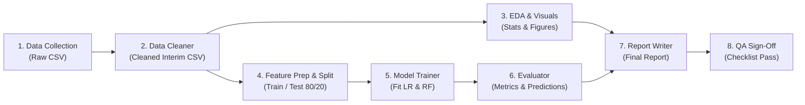

# Student Score Prediction: Project Overview & Context Specification

> **Status:** Specification Complete & Ready for Implementation  
> **Topic:** 01 — Predicting a student's final score prior to final examinations using behavioral, historical, and intermediate academic performance metrics.  
> **Methodology:** Supervised Regression with Multiple Linear Regression (interpretable baseline) and Random Forest Regressor (non-linear comparison).  
> **Source Specification Location:** [`student-score-prediction-spec/`](file:///d:/Sv23/Data_Analysis/student-score-prediction-spec/)

---

## 1. Executive Summary & Project Purpose

### 1.1 The Problem
In academic environments, early identification of students at risk of underperformance or failure allows educators and academic advisors to intervene before final exams take place. By assessing pre-final indicators (class attendance, weekly self-study habits, assignment consistency, midterm examination results, and historical GPA), we seek to quantitatively forecast each student's expected final score ($0$ to $100$) with measurable statistical confidence.

### 1.2 Core Objective
To develop an end-to-end, reproducible, leak-free machine learning data science pipeline that:
1. Validates, cleans, and explores student academic indicators.
2. Formulates descriptive statistics and diagnostic visualizations.
3. Implements and compares Multiple Linear Regression and Random Forest Regressor models on an 80/20 train/test split with 5-fold cross-validation.
4. Explains feature relationships without claiming causal links.
5. Produces an automated report and serialized deployment-ready models.

---

## 2. Technical Scope & Governance Rules

### 2.1 Problem Framing
- **Task Type:** Supervised Regression (continuous target).
- **Target Variable:** `final_score` (continuous float, range $[0.0, 100.0]$).
- **Target Policy:** The problem is explicitly regression. No binarization (pass/fail classification) is permitted.

### 2.2 Input Features
| Feature Name | Type | Range / Domain | Description |
|---|---|---|---|
| `attendance_pct` | `float` | $0.0 - 100.0$ (%) | Percentage of classes attended throughout the term |
| `study_hours_week` | `float` | $0.0 - 80.0$ (hrs/week) | Self-reported weekly study hours dedicated outside class |
| `assignment_avg` | `float` | $0.0 - 100.0$ | Cumulative average score across homework & assignments |
| `midterm_score` | `float` | $0.0 - 100.0$ | Midterm examination score |
| `previous_gpa` | `float` | $0.0 - 4.0$ | Cumulative Grade Point Average from previous semesters |

### 2.3 Strict Project Boundaries
- **In-Scope:** Data ingestion, schema validation, imputation, outlier profiling, EDA (8 questions + 5 core figures), feature scaling, train/test split, model training, cross-validation, residual diagnostics, metric comparison, prediction generation, and final report generation.
- **Out-of-Scope:** Web applications, GUI deployments, binary pass/fail classification, causal claims (correlation does not imply causation), and personally identifiable information (PII).
- **Global Constants:** Seed is fixed to `42` across all random number generators (`numpy`, `scikit-learn`, splitters, model seeds). Single source of truth is `config.yaml`.

---

## 3. End-to-End System Architecture

### 3.1 Data Flow Pipeline
Stages interact strictly through versioned file contracts on disk rather than shared runtime memory:



### 3.2 Anti-Leakage Protocol
1. **Split-First Architecture:** The 80/20 train/test split occurs before any data transformations or scalers are computed.
2. **Scaler Isolation:** Feature scalers (`StandardScaler`) are fit *only* on the training split ($X_{\text{train}}$) and subsequently applied to transform the test set ($X_{\text{test}}$). Scalers are serialized alongside models via scikit-learn `Pipeline` objects.
3. **Target Exclusivity:** `final_score` is strictly excluded from any feature matrices or proxy derivatives.

---

## 4. Data Specification & Data Quality Rules

### 4.1 Canonical Schema (`data/interim/students_clean.csv`)
- `student_id`: Anonymous identifier (`string` or `int`), no PII permitted.
- `attendance_pct`: Float $[0, 100]$. Missing allowed in raw, must be imputed in interim.
- `study_hours_week`: Float $[0, 80]$. Missing allowed in raw, must be imputed in interim.
- `assignment_avg`: Float $[0, 100]$. Missing allowed in raw, must be imputed in interim.
- `midterm_score`: Float $[0, 100]$. Missing allowed in raw, must be imputed in interim.
- `previous_gpa`: Float $[0.0, 4.0]$. Missing allowed in raw, must be imputed in interim.
- `final_score`: Float $[0, 100]$. Target variable; **no missing values allowed** (rows with missing target are dropped).

### 4.2 Data Sources & Integration Strategy
1. **Option A (Class Survey):** High feature fidelity, small sample ($50-150$ records). Requires consent documentation.
2. **Option B (UCI Student Performance):** Real academic benchmark. Requires mapping: `absences` $\to$ `attendance_pct`, `studytime` $\to$ `study_hours_week`, `G1`/`G2` $\to$ `midterm_score`, `G3` $\to$ `final_score`.
3. **Option C (Kaggle Student Performance):** Public repositories. Verify schema match and column definitions.
4. **Option D (Hybrid):** Combined datasets with reconciliation notes.
5. **Option E (Synthetic Benchmark):** Permitted only for verifying pipeline code; must be clearly labeled `SYNTHETIC` and excluded from final empirical conclusions.

### 4.3 Validation Matrix (Rules V1 to V7)
- **V1 (Schema Integrity):** All canonical columns present; pipeline fails immediately if any are absent.
- **V2 (Key Uniqueness):** Deduplicate on `student_id`.
- **V3 (Range Boundaries):** Values out of valid bounds are converted to `NaN` and logged.
- **V4 (Data Type Enforcement):** Coerce non-numeric representations to numeric floats; parsing failures become `NaN`.
- **V5 (Target Completeness):** Drop records with missing `final_score`.
- **V6 (Row Sparsity):** Drop records missing $>50\%$ of feature columns.
- **V7 (Format Normalization):** Strip whitespaces, unify case, standardize numerical formatting.

### 4.4 Missingness & Outlier Treatment
- **Symmetric Distributions ($\text{skew} \in [-0.5, 0.5]$):** Impute missing values using column **Mean**.
- **Skewed Distributions ($|\text{skew}| > 0.5$):** Impute missing values using column **Median**.
- **High Missingness ($>30\%$ missing):** Evaluate feature viability or document proxy usage.
- **Outlier Protocol:** Identify with $1.5 \times \text{IQR}$ and box plots. Retain valid extreme performances (e.g. verified $98\%$ exam scores). Cap or remove only proven measurement anomalies or typographical errors. Log all actions in `reports/tables/cleaning_log.csv`.

---

## 5. Part A: Data Analysis & Visualizations Spec

Part A executes 8 specific analysis phases (A1 to A8):
- **A1 — Problem Definition:** Formal context, stakeholder impact, target metrics.
- **A2 — Data Collection:** Store untouched raw file in `data/raw/students_raw.csv` with `DATA_SOURCE.md` and `DATA_DICTIONARY.md`.
- **A3 & A4 — Data Cleaning & Imputation:** Produce cleaned file `data/interim/students_clean.csv`, `cleaning_log.csv`, and `reports/tables/missing_values.csv`.
- **A5 & A6 — Exploratory Analysis & Descriptive Stats:** Generate summary statistics (count, mean, median, std, min, 25%, 75%, max, skewness, kurtosis) into `reports/tables/descriptive_stats.csv`.
- **A7 — Visualizations Suite (Minimum 5 required):**
  1. `fig01_final_score_hist.png`: Histogram + KDE of `final_score` (Target distribution).
  2. `fig02_corr_heatmap.png`: Correlation matrix of all numeric variables (Collinearity check).
  3. `fig03_midterm_vs_final.png`: Scatter plot with regression line of `midterm_score` vs `final_score`.
  4. `fig04_attendance_box.png`: Box plot of `final_score` grouped by attendance tier: Low ($<70\%$), Medium ($70-89\%$), High ($\ge 90\%$).
  5. `fig05_study_vs_final.png`: Scatter or hexbin plot of `study_hours_week` vs `final_score`.
  6. *Optional Extras:* `fig06_pairplot.png`, `fig07_outliers.png`, `fig08_gpa_vs_final.png`.
- **A8 — 7 Key Exploratory Questions (`reports/tables/eda_findings.md`):**
  1. Which feature exhibits the highest correlation with `final_score`?
  2. Does attendance impact final grade more or less than weekly study hours?
  3. How many anomalous cases exist with high study hours but low scores?
  4. Are identified outliers legitimate student performance variations or data errors?
  5. Are any features correlated above $r > 0.8$ (multicollinearity risk)?
  6. Does `final_score` adhere to an approximately normal distribution?
  7. What unexpected trends or patterns emerge from the empirical observations?

---

## 6. Part B: Machine Learning Pipeline Spec

Part B executes 10 machine learning milestones (B1 to B10):
- **B1 — Target Definition:** `final_score` (unscaled target variable).
- **B2 — Feature Selection & Multicollinearity:** Variance Inflation Factor (VIF) evaluation (flag features with $\text{VIF} > 5.0$). Document selection rationale in `reports/tables/feature_selection_notes.md`.
- **B3 — Preprocessing & Pipelines:** Feature scaling with `StandardScaler`. Encapsulate transformations within `sklearn.pipeline.Pipeline`.
- **B4 — Data Splitting:** $80\%$ Train ($N_{\text{train}}$) and $20\%$ Test ($N_{\text{test}}$) using `random_state=42`. Saved to `data/processed/train.csv` and `data/processed/test.csv`.
- **B5 — Model Training:**
  - *Baseline Model:* Multiple Linear Regression (`LinearRegression()`).
  - *Comparison Model:* Random Forest Regressor (`RandomForestRegressor(n_estimators=300, random_state=42)`).
  - *Optional:* Regularized Ridge regression or Gradient Boosting.
- **B6 & B7 — Model Evaluation & Cross-Validation:**
  - Compute **MAE**, **RMSE**, and **$R^2$** on both training and test sets.
  - Perform 5-fold cross-validation on training data to report mean and standard deviation of $R^2$ and RMSE.
  - Assess overfitting: Flag if $R^2_{\text{train}} - R^2_{\text{test}} > 0.15$.
  - Generate diagnostic residual plots: `fig09_residuals.png` (residuals vs predicted) and `fig10_actual_vs_pred.png` ($45^\circ$ line).
- **B8 — Model Selection Criteria:**
  1. Primary metric: Lowest Test RMSE.
  2. Simplicity rule: If Test RMSE between models differs by $< 2\%$, select the simpler Multiple Linear Regression model for interpretability.
  3. Overfitting rejection: Overfitted models cannot be crowned champion.
- **B9 — Predictive Inferences:**
  - Generate `reports/tables/test_predictions.csv` (`student_id`, `actual`, `predicted`, `error`).
  - Generate `reports/tables/custom_predictions.csv` for synthetic edge scenarios (e.g., high attendance with low midterm; low attendance with high GPA; average on all features).
- **B10 — Model Interpretability & Explanation:**
  - Linear model coefficients (standardized and unstandardized) in `reports/tables/coefficients.csv`.
  - Random Forest feature importances (MDI / permutation importance) in `reports/tables/feature_importance.csv`.
  - Contrast whether linear coefficients and tree-based importances rank predictive drivers identically.

---

## 7. Multi-Agent Operational Framework

The project is structured around 10 distinct, specialized agent personas. Each agent possesses bounded authority, explicit file ownership, and strict input/output contracts.

### 7.1 Agent Roles & Responsibilities

| ID | Agent Name | Primary Responsibility | File Ownership |
|---|---|---|---|
| **00** | **Orchestrator** | Coordinates gates, resolves conflicts, verifies status | `handoff/STATUS_LOG.md`, gate approvals |
| **01** | **Data Collector** | Sourcing dataset, metadata, data dictionary | `data/raw/*`, `DATA_SOURCE.md`, `DATA_DICTIONARY.md` |
| **02** | **Data Cleaner** | Cleaning, validation, handling missing values | `data/interim/*`, `src/cleaning.py`, `cleaning_log.csv`, `missing_values.csv` |
| **03** | **EDA Analyst** | Statistical distributions, correlations, findings | `src/eda.py`, `notebooks/02_eda.ipynb`, `descriptive_stats.csv`, `eda_findings.md` |
| **04** | **Visualization** | Generating clean, publication-ready figures | `reports/figures/fig01_*.png` through `fig08_*.png` |
| **05** | **Feature & Split** | Scaling, VIF check, train/test partitioning | `src/features.py`, `models/scaler.joblib`, `data/processed/*`, `config.yaml` |
| **06** | **Model Trainer** | Fitting regression models and saving joblib artifacts | `src/train.py`, `models/linear_regression.joblib`, `random_forest.joblib` |
| **07** | **Evaluator** | Metrics (MAE/RMSE/R2), CV, predictions, selection | `src/evaluate.py`, `src/predict.py`, `models/best_model.joblib`, `fig09`, `fig10`, metrics tables |
| **08** | **Report Writer** | Compiling the comprehensive analytical report | `reports/final_report.md` |
| **09** | **QA Reviewer** | Verifying deliverables against acceptance criteria | Acceptance sign-off in `STATUS_LOG.md` |

### 7.2 Handoff Protocol & Gates
Execution transitions sequentially. An agent may only initiate work once the preceding agent's handoff note is marked `STATUS: READY`.

```
00 Orchestrator (Start)
  │
  ▼
01 Data Collector ──[Contract: data/raw/students_raw.csv, DICTIONARY.md]──► 02 Data Cleaner
                                                                                   │
  ┌────────────────────────────────────────────────────────────────────────────────┘
  ▼
03 EDA Analyst  ◄───[Collaborative Sync: data/interim/students_clean.csv]───► 04 Visualization
  │
  ▼ [Contract: descriptive_stats.csv, eda_findings.md, fig01-fig05]
05 Feature and Split
  │
  ▼ [Contract: train.csv, test.csv, scaler.joblib, updated config.yaml]
06 Model Trainer
  │
  ▼ [Contract: linear_regression.joblib, random_forest.joblib]
07 Evaluator
  │
  ▼ [Contract: model_comparison.csv, selection_decision.md, predictions, feature_importance]
08 Report Writer
  │
  ▼ [Contract: reports/final_report.md]
09 QA Reviewer
  │
  ▼ [Contract: Full verification against 05_ACCEPTANCE_CRITERIA.md]
00 Orchestrator (Project Closure)
```

---

## 8. Quality Assurance & Acceptance Criteria

Before the project can be signed off, the **QA Reviewer (Agent 09)** evaluates every item in the verification matrix:

### 8.1 Verification Checklist
- [ ] **Part A:**
  - One-paragraph problem definition in place.
  - Raw dataset locked and source documented.
  - Data dictionary complete with definitions and units.
  - Data cleaning log accounts for all row-count modifications.
  - Missingness table complete; no missing values in final feature set.
  - Value ranges strictly respected across all rows.
  - Descriptive stats (mean, std, median, skew, kurtosis) compiled.
  - At least 5 core figures rendered with labeled axes and titles.
  - 7 EDA questions answered in `eda_findings.md`.
- [ ] **Part B:**
  - Target defined exclusively as `final_score` and excluded from features.
  - Feature selection supported by VIF analysis and EDA findings.
  - Scaler fit on training split only (zero test leakage).
  - 80/20 train/test split executed with seed `42`.
  - Linear Regression and Random Forest Regressor models trained and serialized.
  - MAE, RMSE, and $R^2$ calculated across both train and test splits.
  - 5-fold cross-validation metrics reported (mean $\pm$ std).
  - Model selection strictly adheres to RMSE and 2% parsimony rule.
  - Test predictions and at least 3 custom test cases recorded.
  - Standardized coefficients and feature importances detailed.
- [ ] **Engineering & Code Quality:**
  - Fresh clone executes cleanly via `requirements.txt`.
  - All paths, column names, hyperparameters read from `config.yaml`.
  - No hardcoded local or absolute machine paths.
  - Automated tests pass via `pytest tests/`.
- [ ] **Reporting Integrity:**
  - Report matches the 15 required sections in `docs/06_REPORT_SPEC.md`.
  - Every numerical metric cited in text matches the generated CSV tables exactly.
  - Limitations honestly state data constraints.
  - Language strictly utilizes associational terms ("associated with") rather than causal assertions.

### 8.2 Red Flag Triggers (Mandatory Halts)
| Indicator | Potential Root Cause | Required Action |
|---|---|---|
| Test $R^2 > 0.98$ | Target leakage or inclusion of target proxy in features | Halt pipeline; audit feature matrix |
| Test $R^2 < 0.0$ | Pipeline defect, inverted targets, or zero predictive signal | Inspect scaling and model fitting code |
| $R^2_{\text{train}} - R^2_{\text{test}} > 0.15$ | Severe model overfitting | Regularize model parameters (e.g. prune RF depth) |
| Test score vastly outperforms CV | Favorable or biased train/test split | Re-evaluate split distribution and stratification |
| Numerical divergence across runs | Unset random seeds | Ensure `seed: 42` is set in all libraries |

---

## 9. Proposed Directory Layout & System Configuration

### 9.1 Target Workspace Layout
```
Data_Analysis/
├── config.yaml                     # Single source of truth configuration
├── requirements.txt                # Pinned dependencies
├── README.md                       # Project landing page & quickstart
├── PROJECT_OVERVIEW_CONTEXT.md     # This comprehensive master context file
├── student-score-prediction-spec/  # Detailed specifications & agent briefs
├── data/
│   ├── raw/                        # Untouched source datasets & source doc
│   │   ├── students_raw.csv
│   │   ├── DATA_SOURCE.md
│   │   └── DATA_DICTIONARY.md
│   ├── interim/                    # Cleaned, validated canonical data
│   │   └── students_clean.csv
│   └── processed/                  # Scaled & partitioned modeling splits
│       ├── train.csv
│       └── test.csv
├── notebooks/
│   ├── 01_data_cleaning.ipynb
│   ├── 02_eda.ipynb
│   └── 03_modeling.ipynb
├── src/
│   ├── __init__.py
│   ├── config.py                   # YAML config loader
│   ├── data_loader.py              # Ingestion utilities
│   ├── cleaning.py                 # Cleaning & imputation logic
│   ├── eda.py                      # Statistical summaries
│   ├── features.py                 # Split & scaling pipeline
│   ├── train.py                    # Model fitting routines
│   ├── evaluate.py                 # Evaluation metrics & diagnostics
│   └── predict.py                  # Prediction inference scripts
├── models/
│   ├── scaler.joblib
│   ├── linear_regression.joblib
│   ├── random_forest.joblib
│   └── best_model.joblib
├── reports/
│   ├── figures/                    # Exported charts (fig01 - fig10)
│   ├── tables/                     # Output metrics, stats, predictions
│   └── final_report.md             # Complete academic/technical report
├── tests/
│   ├── test_cleaning.py
│   └── test_pipeline.py
└── handoff/                        # Agent handoff notes & audit trail
    ├── STATUS_LOG.md
    └── handoff_*.md
```

### 9.2 Configuration Reference (`config.yaml`)
```yaml
seed: 42
target: final_score
features:
  - attendance_pct
  - study_hours_week
  - assignment_avg
  - midterm_score
  - previous_gpa
split:
  test_size: 0.20
  train_size: 0.80
paths:
  raw: data/raw/students_raw.csv
  interim: data/interim/students_clean.csv
  train: data/processed/train.csv
  test: data/processed/test.csv
  figures: reports/figures
  tables: reports/tables
  models: models
models:
  linear_regression: {}
  random_forest:
    n_estimators: 300
    max_depth: null
    random_state: 42
cv_folds: 5
```

---

## 10. Execution Roadmap & Next Actions

To implement this project from scratch:

1. **Phase 1: Environment & Scaffolding**
   - Create the directory tree (`data/`, `src/`, `notebooks/`, `reports/`, `models/`, `tests/`, `handoff/`).
   - Create `config.yaml` and `requirements.txt`.
2. **Phase 2: Data Ingestion (Agent 01)**
   - Select and download the source dataset (e.g. Kaggle student performance, UCI Student Performance, or class survey data).
   - Deposit in `data/raw/` with data dictionary and provenance notes.
3. **Phase 3: Cleaning & Validation (Agent 02)**
   - Implement `src/cleaning.py` to enforce canonical schema, range boundaries, and missingness imputation.
   - Produce `data/interim/students_clean.csv`.
4. **Phase 4: EDA & Visualization (Agents 03 & 04)**
   - Execute descriptive statistics and generate figures (`fig01` to `fig08`).
   - Document answers to the 7 core exploratory questions.
5. **Phase 5: Feature Engineering & Modeling (Agents 05 & 06)**
   - Implement `src/features.py` (80/20 train/test split, scikit-learn Pipeline with `StandardScaler`).
   - Train Multiple Linear Regression and Random Forest Regressor models in `src/train.py`.
6. **Phase 6: Evaluation, Inferences & Interpretation (Agent 07)**
   - Compute MAE, RMSE, $R^2$, 5-fold CV, residual plots (`fig09`, `fig10`).
   - Execute model selection and run predictions on test and custom student profiles.
7. **Phase 7: Synthesis & QA Sign-off (Agents 08 & 09)**
   - Draft `reports/final_report.md` incorporating all generated artifacts.
   - Complete acceptance criteria verification checklist.
